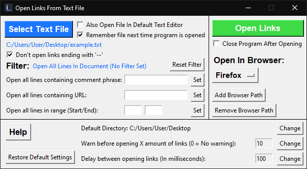

# Open Links From Txt File

**Open Links From Txt File**, or just **Link Opener**, is a desktop GUI application made for Windows that allows the user to automatically open a batch of URLs stored in a .txt file. It also works with most other line-based text files. 

The application was made with Python and Tkinter, and requires Python to run.

## Features

This application also allows you to:

- Filter the links to open based on comments placed next to URL
- Filter the links to open based on the URL
- Only open links within specific lines in the text file
- Ignore links you don't want to open by setting a flag in the text file
- Select which specific browser to open links in
- Set a time delay between opening each link
- Automatically select the same text file next time the application is ran
- Save user configuration

## How To Use

**Important!** The text file needs to be structured in the following way, or else the script will fail:

- The URL needs to be the first thing on every line (Invalid URLs will still be attempted)
- Only one URL per line
- Comment placed next to an URL needs to be separated by a space or a tab
- Everything after the first space or tab is considered as a comment
- To ignore a line, add '--' to the end of the URL before any space or tab 
  For example: *https://www.google.com/--*  
  *This also works to ignore any text, as long as there is no space or tab before the '--'*
- Empty lines will get skipped

### Tutorial
1. Click on **'Add Browser Path'** and select the .exe of the browser you wish to open the links in.  
You can add multiple browsers and switch between them.
2. Click on **'Select Text File'** to select the .txt file containing the links.
3. Type in the specific filter you wish to set and then click on **'Set'** next to its input field.  
(Only one filter can be set at a time)
4. Click on **'Open Links'** to open your links.
## Saved Configuration

User configuration is stored in a *'config.ini'* file that gets automatically created in the same directory as the *'link_opener.py'* file when it's run for the first time.